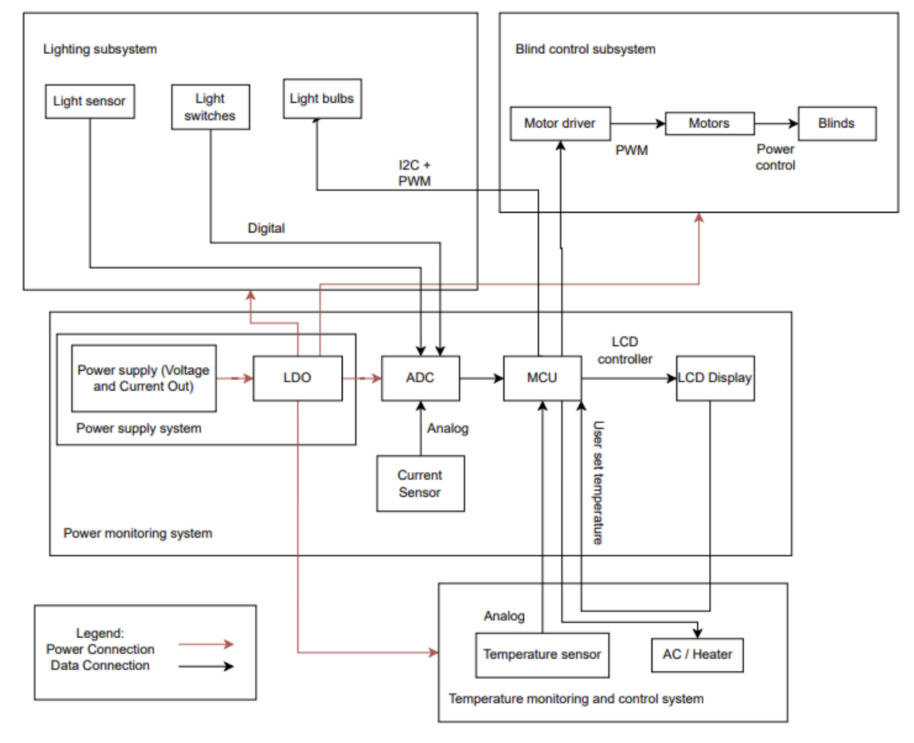
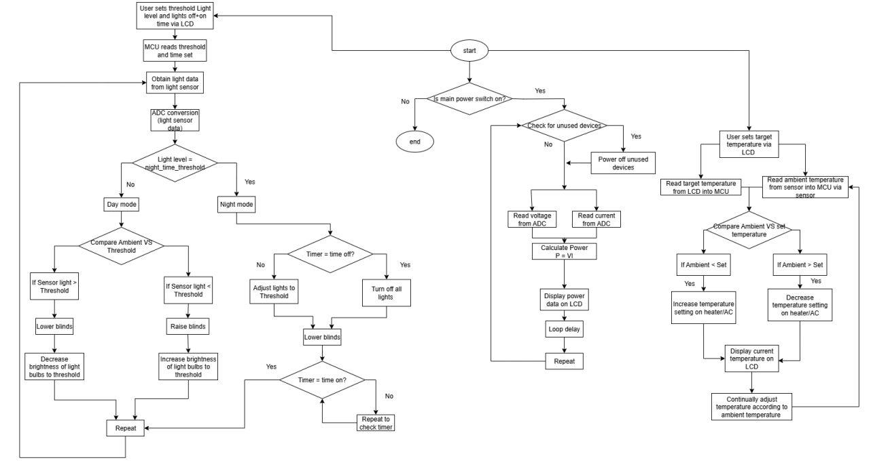

# Home Automation Control Hub

An embedded home automation prototype built on the ARM LPC2478 microprocessor, featuring a touchscreen LCD interface for controlling motorised blinds, a smart plug, doorbell with speaker output, and light-sensor-driven automation.

## System Block Diagram



## Control Flow



## Features

- **Touchscreen UI** — QVGA LCD with debounced touch handling and manual override controls for all connected appliances
- **Motorised Blinds** — Two independently controlled blinds: one timer-based (scheduled), one light-sensor-based (automatic)
- **Smart Plug** — Timer-scheduled appliance switching (e.g., coffee machine)
- **Doorbell** — Physical button with DAC-driven speaker output and melody playback
- **Light Sensor Automation** — TEMT6000 ambient light sensor via ADC drives automatic blind control to reduce energy consumption
- **Real-Time Clock** — On-screen timer display with time-based automation triggers

## Hardware

| Component | Purpose |
|-----------|---------|
| NXP LPC2478 (ARM7TDMI) | Main microcontroller |
| QVGA LCD + Touchscreen | User interface |
| TEMT6000 Light Sensor | Ambient light measurement (ADC) |
| DAC Output | Doorbell speaker/tones |
| GPIO | Blind motors, smart plug relay, LEDs, buttons |

## Project Structure

```
src/
├── main.c              # Main loop: polling, touch handling, task scheduling
├── ui.c/h              # Touchscreen UI drawing and button hit detection
├── lcd_init.c/h        # LCD and SDRAM initialisation
├── touch.c/h           # Touchscreen driver (SPI read, calibration)
├── blinds.c/h          # Motorised blind control (timer + light-based)
├── smartplug.c/h       # Smart plug scheduling and GPIO control
├── doorbell_new.c/h    # Doorbell button polling and playback trigger
├── play_tone.c/h       # DAC tone generation
├── songs.c/h           # Melody data for doorbell
├── light_sensor.c/h    # TEMT6000 ADC reading and display
├── temt6000.c/h        # ADC setup for light sensor
├── manual_timer.c/h    # Timer-based scheduling logic
├── timer.c/h           # Hardware timer polling
├── adc_test.c/h        # ADC peripheral test utilities
├── delay.c/h           # Software delay routines
└── lcd/                # LCD driver library (graphics, fonts, SDRAM)
```

## Tools

- **IDE:** Keil uVision 5
- **Language:** C, ARM Assembly
- **Target:** NXP LPC2478 (ARM7TDMI-S)

## Building

Open `home_automation_project.uvproj` in Keil uVision and build/flash to the LPC2478 development board.

